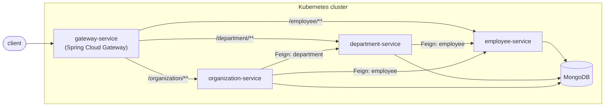

[](https://opensource.org/licenses/MIT)
[](https://spring.io/projects/spring-boot)
[](https://spring.io/projects/spring-cloud)
[](https://adoptium.net/)

# spring-microservices-docker-kubernetes

A small reference stack of four Spring Boot microservices — **Employee**, **Department**, **Organization** and an edge **Gateway** — wired together with Spring Cloud, backed by MongoDB, and packaged to run on Kubernetes.

It exists mainly as a hands-on playground for the plumbing every microservice fleet needs: service discovery, client-side load balancing, externalized config, health probes, metrics, tracing and API docs — without any real business logic getting in the way.

## Architecture



Every service registers itself and discovers its peers through the Kubernetes API (`spring-cloud-kubernetes-fabric8`) — there is no Eureka, Consul or Zookeeper in this stack. The gateway routes requests through static routes declared in its `application.yml` (`/employee/**`, `/department/**`, `/organization/**`, each with `StripPrefix=1` pointing at the Service's cluster DNS name). The discovery locator is disabled: it kept stale routes (404) when a gateway pod started in the middle of a rollout. Adding a fifth service therefore means adding a route there.

## Services

| Service               | Role                                            | Talks to                     | Docs (once running)         |
|-----------------------|--------------------------------------------------|-------------------------------|------------------------------|
| `gateway-service`     | Edge router / reverse proxy                      | all of the below (static routes) | `/actuator`                  |
| `employee-service`    | CRUD for employees, backed by MongoDB            | —                              | `/swagger-ui.html`           |
| `department-service`  | CRUD for departments; enriches with employee data| `employee-service` (Feign)     | `/swagger-ui.html`           |
| `organization-service`| CRUD for organizations; enriches with dept/employee data | `department-service`, `employee-service` (Feign) | `/swagger-ui.html` |

All four expose Spring Boot Actuator on the same port as the app (`health`, `info`, `metrics`, `prometheus`).

## Tech stack

- **Runtime**: Java 17, Spring Boot 4.1.1, Spring Cloud 2025.1.2
- **Discovery & routing**: `spring-cloud-starter-kubernetes-fabric8-all`, Spring Cloud Gateway, Spring Cloud LoadBalancer, Spring Cloud OpenFeign
- **Persistence**: MongoDB (`spring-boot-starter-data-mongodb`)
- **Observability**: Micrometer + Prometheus registry, Micrometer Tracing (Brave bridge)
- **API docs**: springdoc-openapi (OpenAPI 3 / Swagger UI)
- **Packaging**: layered Spring Boot JARs on distroless Java 17 base images
- **Orchestration**: Kubernetes manifests live in the [`spring-microservices-gitops`](https://github.com/IKauedev/spring-microservices-gitops) repository (single source of truth), driven by the shell scripts under [`scripts/`](scripts)

## Repository layout

```
.
├── employee-service/       # Spring Boot app + Dockerfile
├── department-service/     # Spring Boot app + Dockerfile
├── organization-service/   # Spring Boot app + Dockerfile
├── gateway-service/        # Spring Boot app + Dockerfile
├── scripts/
│   ├── lib/                # env.sh (nomes, namespaces) + common.sh (caminhos, use_cluster)
│   ├── cluster/            # start, setup, stop, destroy, ip
│   ├── deploy/             # build-app, build-push, install-*, delete-*
│   ├── ops/                # logs, exec, populate-data, gateway-open, expose-all
│   └── argocd/             # bootstrap, port-forward, password, status
└── pom.xml                 # Reactor parent (aggregates the four modules)
```

## Prerequisites

- Docker
- [Minikube](https://kubernetes.io/docs/tasks/tools/install-minikube/) + a hypervisor (e.g. VirtualBox)
- `kubectl`
- JDK 17 (via [sdkman](https://sdkman.io/install): `sdk install java 17.0.16-tem`)
- Apache Maven
- `curl` / [HTTPie](https://httpie.org/) for the sample requests below

## Build

```bash
git clone git@github.com:IKauedev/spring-microservices-docker-kubernetes.git
cd spring-microservices-docker-kubernetes
mvn clean package
```

This builds and tests all four modules and produces a layered, executable JAR per service under each `target/` directory.

## CI

[`.github/workflows/ci.yml`](.github/workflows/ci.yml) runs on every push to `master` and on pull requests:

| Job | What it does |
|---|---|
| `build-test` | `mvn verify` for each service in parallel (JDK 17), uploading the Surefire reports |
| `lint` | `bash -n` + `shellcheck` on `scripts/**/*.sh` and `docker compose config` |
| `smoke-test` | `docker compose up --build`, then [`scripts/ci/smoke-test.sh`](scripts/ci/smoke-test.sh) exercises the API through the gateway (employee → department → organization, including the Feign call) |

The smoke test also runs against a cluster: `kubectl port-forward -n gateway svc/gateway 8080:8080` and `./scripts/ci/smoke-test.sh`. Manifests are validated in the [gitops repository](https://github.com/IKauedev/spring-microservices-gitops).

## Run on Kubernetes

The `scripts/` directory wraps the whole lifecycle around a dedicated Minikube profile:

```bash
cd scripts/
./cluster/start.sh        # boot the Minikube profile (MINIKUBE_MEMORY=12000mb, MINIKUBE_CPUS=6 by default)
./cluster/setup.sh        # namespaces and RBAC (k8s/platform)
./deploy/install-all.sh   # build images and apply each app with kubectl apply -k
./ops/populate-data.sh    # seed sample employees/departments/organizations
./ops/gateway-open.sh     # open the Swagger UI through the gateway
./ops/expose-all.sh       # expose every service on localhost (8080-8083, mongo 27017, Argo CD https://localhost:8443)
```

Tear down with:

```bash
./deploy/delete-all.sh    # remove the app's k8s resources
./cluster/destroy.sh      # remove namespaces/RBAC
./cluster/stop.sh         # stop the Minikube profile
```

`./ops/employee-log.sh`, `./ops/department-log.sh`, `./ops/organization-log.sh` and `./ops/gateway-log.sh` tail a given service's pod logs.

The scripts locate the repository on their own (via `scripts/lib/common.sh`), so they work from any directory.

### GitOps with Argo CD

The cluster configuration (`k8s/` and `argocd/`) lives **only** in [`spring-microservices-gitops`](https://github.com/IKauedev/spring-microservices-gitops); this repository holds the code. The scripts clone it next to this folder on first use (override with `GITOPS_DIR=/path`). With Argo CD installed in the cluster, `./argocd/bootstrap.sh` applies its `argocd/root-app.yaml`; it creates one Application per folder in `k8s/` and keeps the cluster in sync with that repository's `master`. To change a manifest, edit and push it there. Manifests are Kustomize `base/` + `overlays/<env>` (`dev` by default; `ENV_NAME=prod ./deploy/install-all.sh` picks another one), and an `ApplicationSet` generates one Argo Application per environment and app — see that repository's README to add a cluster.

```bash
./argocd/bootstrap.sh      # register the root app (app of apps)
./argocd/status.sh         # sync/health of every Application
./argocd/port-forward.sh   # UI at https://localhost:8443 (user: admin)
./argocd/password.sh       # initial admin password
```

## Run locally with Docker Compose

For a quick, cluster-free way to run the stack, [`docker-compose.yml`](docker-compose.yml) builds and runs
the four apps plus MongoDB with plain Docker networking:

```bash
docker compose up --build
```

| Service                | URL                    |
|-------------------------|-------------------------|
| Gateway                 | http://localhost:8080  |
| Employee (direct)       | http://localhost:8081  |
| Department (direct)     | http://localhost:8082  |
| Organization (direct)   | http://localhost:8083  |
| MongoDB                 | localhost:27017        |

Kubernetes service discovery isn't available outside a cluster, so this file disables
`spring.cloud.kubernetes` and wires the same routing statically instead: Feign clients get their
target services from Spring Cloud's Simple Discovery Client, and the gateway gets a fixed
route per service (`ROUTES_n_*`, overriding the cluster-DNS defaults declared in the gateway's `application.yml`).

## Talking to the API

Once deployed, each service is reachable directly (`minikube service <name> --url -n <namespace>`) or through the gateway. A couple of examples against `employee-service`:

```bash
# create
curl -X POST "$EMPLOYEE_URL/" -H "Content-Type: application/json" \
  -d '{"id":"1","name":"Smith","age":25,"position":"engineer","departmentId":1,"organizationId":1}'

# read
curl "$EMPLOYEE_URL/"
```

### Endpoints

Paths are relative to each service (through the gateway, prefix them with `/employee`, `/department` or `/organization`).

| Service | Method & path | Description |
|---------|---------------|-------------|
| employee | `POST /`, `GET /`, `GET /{id}`, `PUT /{id}`, `DELETE /{id}` | CRUD (`DELETE` returns `204`) |
| employee | `GET /search?name=&position=&page=&size=` | Paged search (name partial, position exact), sorted by name; `size` is capped at 100 |
| employee | `GET /count`, `GET /stats` | Total; total + average age + count per position |
| employee | `GET /department/{id}`, `GET /department/{id}/count`, `DELETE /department/{id}` | Per-department list, count and bulk delete |
| employee | `GET /organization/{id}`, `GET /organization/{id}/count` | Per-organization list and count |
| department | `POST /`, `GET /`, `GET /{id}`, `PUT /{id}`, `DELETE /{id}` | CRUD |
| department | `GET /{id}/with-employees` | Department enriched with its employees (Feign) |
| department | `GET /search?name=`, `GET /count` | Paged search and total |
| department | `GET /organization/{id}`, `/organization/{id}/count`, `/organization/{id}/with-employees` | Per-organization queries |
| organization | `POST /`, `GET /`, `GET /{id}`, `PUT /{id}`, `DELETE /{id}` | CRUD |
| organization | `GET /{id}/summary` | Number of departments and employees (Feign) |
| organization | `GET /{id}/with-departments`, `/with-employees`, `/with-departments-and-employees` | Enriched views (Feign) |
| organization | `GET /search?name=`, `GET /count` | Paged search and total |

Each service is layered `controller -> service -> repository` (plus `client` for Feign). Request bodies are validated (`name` must not be blank, employee `age` must be 0-150) and every error is returned as RFC 9457 `application/problem+json`: `400` for invalid input, `404` for unknown resources, `502` when a downstream service fails.

See [`scripts/populate-data.sh`](scripts/populate-data.sh) for the full set of sample payloads across employee, department and organization.

## Observability

- **Health / readiness / liveness**: `GET /actuator/health` (wired into the Kubernetes probes in each `k8s/<app>/deployment.yaml` of the gitops repo)
- **Metrics**: `GET /actuator/prometheus` (Micrometer's Prometheus registry)
- **Tracing**: request-scoped trace/span IDs via Micrometer Tracing, correlated in the log pattern configured in each `k8s/<app>/configmap.yaml` of the gitops repo
- **API docs**: `GET /swagger-ui.html` and `GET /v3/api-docs` on each of the three domain services

## License

MIT — see [LICENSE](LICENSE). The original copyright notice from the upstream project is preserved alongside this fork's, as required by the MIT terms.
