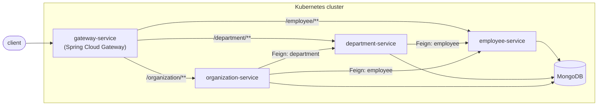

[](https://opensource.org/licenses/MIT)
[](https://spring.io/projects/spring-boot)
[](https://spring.io/projects/spring-cloud)
[](https://adoptium.net/)

# spring-microservices-docker-kubernetes

A small reference stack of four Spring Boot microservices — **Employee**, **Department**, **Organization** and an edge **Gateway** — wired together with Spring Cloud, backed by MongoDB, and packaged to run on Kubernetes.

It exists mainly as a hands-on playground for the plumbing every microservice fleet needs: service discovery, client-side load balancing, externalized config, health probes, metrics, tracing and API docs — without any real business logic getting in the way.

> This project is a fork of [AndriyKalashnykov/spring-microservices-k8s](https://github.com/AndriyKalashnykov/spring-microservices-k8s) (originally written for the Tanzu Development Center), migrated from Spring Boot 2.3 / Java 8-11 to **Spring Boot 4.1.1** and **Spring Cloud 2025.1 (Oakwood)** on **Java 17**. Netflix Zuul, Netflix Ribbon, Spring Cloud Sleuth and Springfox — all discontinued — were replaced with Spring Cloud Gateway, Spring Cloud LoadBalancer, Micrometer Tracing and springdoc-openapi respectively.

## Architecture



Every service registers itself and discovers its peers through the Kubernetes API (`spring-cloud-kubernetes-fabric8`) — there is no Eureka, Consul or Zookeeper in this stack. The gateway routes requests purely by service name via Spring Cloud Gateway's discovery locator, so adding a fifth service to the cluster requires no gateway configuration change.

## Services

| Service               | Role                                            | Talks to                     | Docs (once running)         |
|-----------------------|--------------------------------------------------|-------------------------------|------------------------------|
| `gateway-service`     | Edge router / reverse proxy                      | all of the below (discovery)  | `/actuator`                  |
| `employee-service`    | CRUD for employees, backed by MongoDB            | —                              | `/swagger-ui.html`           |
| `department-service`  | CRUD for departments; enriches with employee data| `employee-service` (Feign)     | `/swagger-ui.html`           |
| `organization-service`| CRUD for organizations; enriches with dept/employee data | `department-service`, `employee-service` (Feign) | `/swagger-ui.html` |

All four expose Spring Boot Actuator on the same port as the app (`health`, `info`, `metrics`, `prometheus`).

## Tech stack

- **Runtime**: Java 17, Spring Boot 4.1.1, Spring Cloud 2025.1.2
- **Discovery & routing**: `spring-cloud-starter-kubernetes-fabric8-all`, Spring Cloud Gateway, Spring Cloud LoadBalancer, Spring Cloud OpenFeign
- **Persistence**: MongoDB (`spring-boot-starter-data-mongodb`)
- **Observability**: Micrometer + Prometheus registry, Micrometer Tracing (Brave bridge)
- **API docs**: springdoc-openapi (OpenAPI 3 / Swagger UI)
- **Packaging**: layered Spring Boot JARs on distroless Java 17 base images
- **Orchestration**: Kubernetes manifests under [`k8s/`](k8s), driven by the shell scripts under [`scripts/`](scripts)

## Repository layout

```
.
├── employee-service/       # Spring Boot app + Dockerfile
├── department-service/     # Spring Boot app + Dockerfile
├── organization-service/   # Spring Boot app + Dockerfile
├── gateway-service/        # Spring Boot app + Dockerfile
├── k8s/                    # Deployments, Services, ConfigMaps, Secrets, RBAC, Ingress
├── scripts/                # Minikube lifecycle, build/push, log-tailing, sample data
└── pom.xml                 # Reactor parent (aggregates the four modules)
```

## Prerequisites

- Docker
- [Minikube](https://kubernetes.io/docs/tasks/tools/install-minikube/) + a hypervisor (e.g. VirtualBox)
- `kubectl`
- JDK 17 (via [sdkman](https://sdkman.io/install): `sdk install java 17.0.16-tem`)
- Apache Maven
- `curl` / [HTTPie](https://httpie.org/) for the sample requests below

## Build

```bash
git clone git@github.com:IKauedev/spring-microservices-docker-kubernetes.git
cd spring-microservices-docker-kubernetes
mvn clean package
```

This builds and tests all four modules and produces a layered, executable JAR per service under each `target/` directory.

## Run on Kubernetes

The `scripts/` directory wraps the whole lifecycle around a dedicated Minikube profile:

```bash
cd scripts/
./start-cluster.sh     # boot the Minikube profile
./setup-cluster.sh     # namespaces, RBAC, secrets
./install-all.sh       # build images and apply the k8s manifests
./populate-data.sh     # seed sample employees/departments/organizations
./gateway-open.sh      # open the Swagger UI through the gateway
```

Tear down with:

```bash
./delete-all.sh        # remove the app's k8s resources
./destroy-cluster.sh    # remove namespaces/RBAC
./stop-cluster.sh      # stop the Minikube profile
```

`./employee-log.sh`, `./department-log.sh` and `./organization-log.sh` tail a given service's pod logs.

## Talking to the API

Once deployed, each service is reachable directly (`minikube service <name> --url -n <namespace>`) or through the gateway. A couple of examples against `employee-service`:

```bash
# create
curl -X POST "$EMPLOYEE_URL/" -H "Content-Type: application/json" \
  -d '{"id":"1","name":"Smith","age":25,"position":"engineer","departmentId":1,"organizationId":1}'

# read
curl "$EMPLOYEE_URL/"
```

See [`scripts/populate-data.sh`](scripts/populate-data.sh) for the full set of sample payloads across employee, department and organization.

## Observability

- **Health / readiness / liveness**: `GET /actuator/health` (wired into the Kubernetes probes in `k8s/*-deployment.yaml`)
- **Metrics**: `GET /actuator/prometheus` (Micrometer's Prometheus registry)
- **Tracing**: request-scoped trace/span IDs via Micrometer Tracing, correlated in the log pattern configured in each `*-configmap.yaml`
- **API docs**: `GET /swagger-ui.html` and `GET /v3/api-docs` on each of the three domain services

## License

MIT — see [LICENSE](LICENSE). The original copyright notice from the upstream project is preserved alongside this fork's, as required by the MIT terms.
